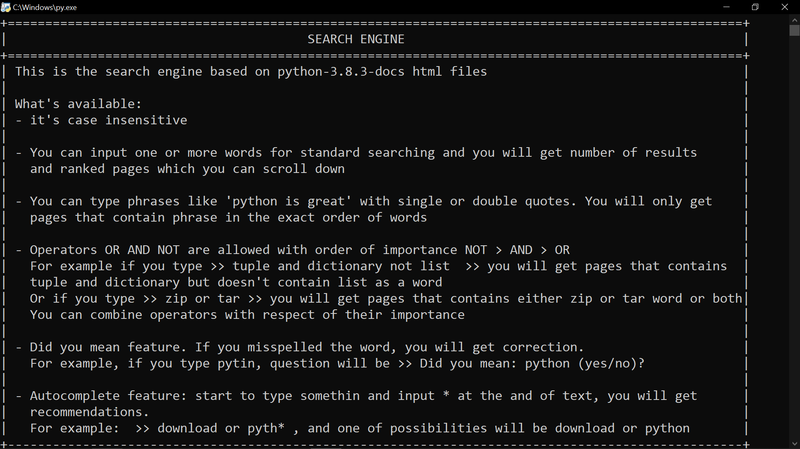
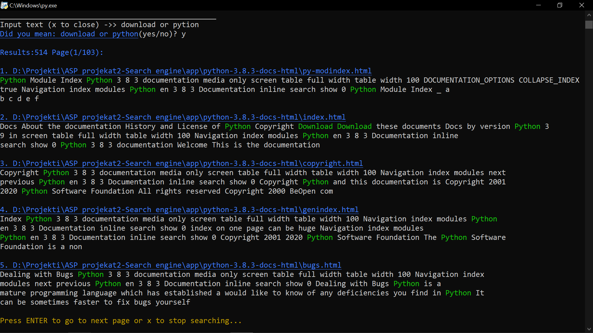

# Search-Engine-Python

Search engine console application based on **python-3.8.3-docs-html**

## How it was implemented?

- It uses **parser_html.py** to parse html pages into list of words and links. There is about 500 html pages in **python-3.8.3-docs-html** folder

- Page can have links to other pages. Single page is organized as **trie data structure** for fast operations of finding matching words.

- All pages together are organized as **directed graph**, where vertices are single pages and edges are links to other pages in graph

- Because of lot of pages, first time running this program can take up to minute, it depends how fast your computer is, because of that,
i have used built-in module **pickle** to serialize the graph so i don't have to make new one every time I run the program.
Graph is serialized into **graph_serialization.bin**

- **Ranking system** in quite simple, for example, for page A, i was checking the number of words on that page and number of words in other pages that points to page A. If page A and page B has the same rank, then page A will be ranked better if it has more inbound links then page B and vice versa

## How can test this?

- Simple run **main.py** and wait a few seconds

## Feautures:

## How does it look:

## Contributing

For example:
- you can improve the ranking system or add other features

- you can make GUI on top of this

feel free to expriment and change anything you want

*Make pull request, i will review that and merge that into project*
